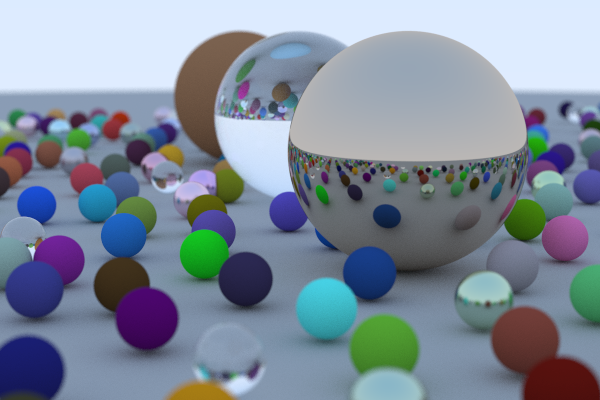

# rtiow-rs
[raytracing in one weekend](https://raytracing.github.io/books/RayTracingInOneWeekend.html) (re)-written in rust

This is mostly just manually transpiled, but I did have to rewrite some parts due to the differences in how C++ and Rust deal with structs, classes, enums, etc.

This is what the final result looks like.

